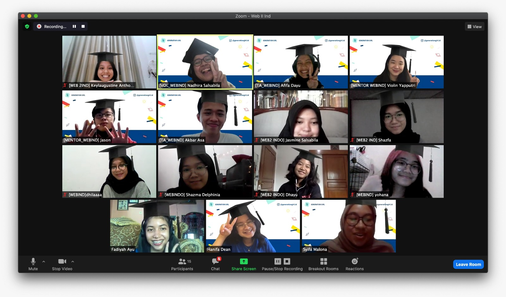

# BUILD A WEBSITE II

##### This repository for Generation Girl Winter Club 2020: Build a Website II Bahasa Class (28 Dec 2020 - 1 Jan 2021)

## Snapshot
 

## Material Recap

#### Day 1
1. HTML, CSS, JavaScript Refresher
2. Intro to JavaScript and GitHub

#### Day 2
1. Intro to ReactJS
2.. Create React App (Installing Reactbootstrap, NPM)
3. Import, Export, Component, Props

#### Day 3
1. Make a To Do List App
2. Foldering
3. State, Function
4. Example code: [Click here](https://github.com/afifadayu/bawii-indo/tree/main/day3-todolist-app)

#### Day 4
Preparation for Final Presentation

#### Day 5
Final Presentation

Mentor:
* [Violin](https://github.com/violinyap)
* [Jason](https://github.com/sportsjay)

Teaching Assistant:
* [Dayu](https://github.com/afifadayu)
* [Asa](https://github.com/akbarasa)

Volunteer:
* Nadhira

### Planning Material: [Click here](https://github.com/afifadayu/bawii-indo/tree/main/plan)
